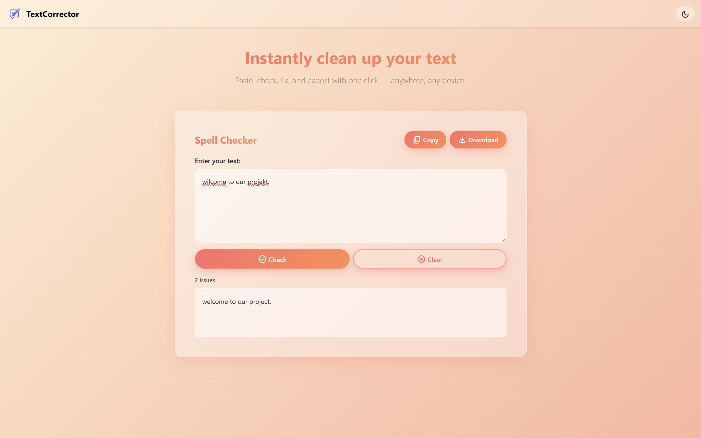
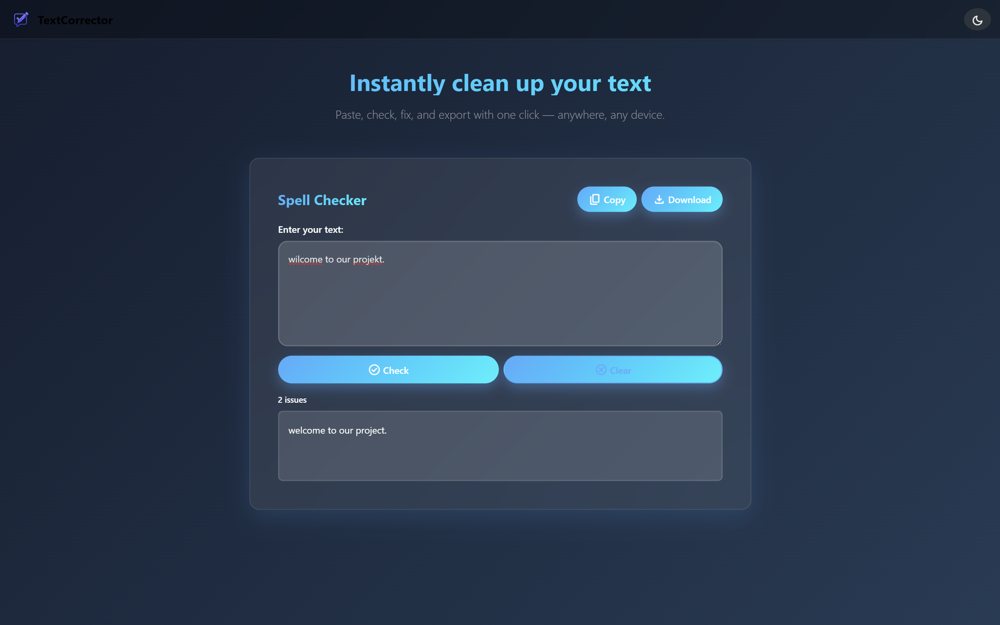

# TextCorrector
#### Video Demo: <URL HERE>
#### Description:


This repository intentionally supports **two execution modes**, so the spell-checker can be demonstrated in different ways:

1. **Browser-first mode (Pyodide):** Python runs directly inside the browser using Pyodide. The UI calls a JavaScript function (`window.checkText`) that forwards the text to Python, performs spelling checks, and returns a structured result. This mode is useful when you want the correction logic to run on the client side, without a traditional server request.

2. **Backend mode (Flask API):** A local Flask server exposes endpoints such as `/health` and `/check`. The server calls the same core spell-checking logic and returns JSON. This mode is useful for integration with other applications (scripts, tools, or services), automated testing, or a conventional “frontend + API” architecture.

In both modes, the project focuses on **spelling** (not grammar). The correction engine is based on `pyspellchecker`, and the repository includes an English word list that can be extended to improve accuracy for domain-specific vocabulary.

---
## Screenshots

### Light Mode


### Dark Mode


---
## Features
- Web UI with clear actions: **Check**, **Clear**, **Copy**, **Download**
- Detects misspelled words and applies suggested corrections
- Shows a status line (e.g., “Checking…” + issue count)
- Downloads corrected text as `textcorrector_output.txt`
- Theme toggle (light/dark) with persistence via `localStorage`
- Optional Flask API for programmatic usage
- Local dictionary file included (`libs/dictionary/en_dict.txt`) and a script to build/expand it

---

## Quick Start
### Prerequisites
- Python 3.x installed (recommended: 3.10+)
- Install backend dependencies (required for the launcher and for backend mode):

```bash
pip install -r libs/spellchecker/requirements.txt
```

### Windows (one command)
```bat
run.bat
```
or
```bat
python run_app.py
```

### What the launcher does
`run_app.py` starts:
- A simple static server (`python -m http.server`) on port **5500** (to serve the frontend files)
- A Flask API server on port **8000**

Open:
- Frontend: `http://127.0.0.1:5500/src/frontend/index.html`
- Backend: `http://127.0.0.1:8000`

---

## Usage
1. Open the frontend page in your browser.
2. Paste English text into the input box.
3. Click **Check**.
4. Review the corrected output and the issue count.
5. Click **Copy** to copy the corrected text or **Download** to save it as a file.
6. Click **Clear** to reset the input/output.

---

## API (Flask backend)
### Health check
```bash
curl http://127.0.0.1:8000/health
```

### Spell check
```bash
curl -X POST http://127.0.0.1:8000/check   -H "Content-Type: application/json"   -d "{"text":"Ths is a smple txt"}"
```

Typical response fields:
- `corrected_text`: corrected string
- `mistake_count`: number of misspelled tokens found
- `misspelled`: list of misspelled words
- `fixes`: list of pairs `(wrong_word, suggestion)`

---

## What each file/folder contains (and why it exists)
This section documents the important files in the repository and what they do.

### Root
- **`run_app.py`**: Main launcher. Starts a static file server (frontend) and a Flask server (backend) and prints the URLs to open.
- **`run.bat`**: Convenience script for Windows users to run the launcher.
- **`README.md`**: Project documentation (this file).

### `src/frontend/`
- **`index.html`**: The main web page. It wires Bootstrap, loads Pyodide setup, and includes the application script.
- **`style.css`**: Styling for layout and themes (light/dark).
- **`app.js`**: Frontend logic: button handlers, theme persistence, copy/download actions, and the call to `window.checkText`.

### `libs/pyodide/`
- **`pyodide_setup.js`**: The “bridge” that loads Pyodide, installs required Python packages (via `micropip`), runs Python code, and exposes `window.checkText(text)` to the UI.
- **`0.26.1/`**: Pyodide assets (included for optional local/offline serving).

### `src/backend/`
- **`server.py`**: Flask app with endpoints (`/health`, `/check`).
- **`spell_checker.py`**: Core spell-check logic (normalization, tokenization, misspelling detection, and correction).
- **`utils/text_utils.py`**: Helper functions for cleaning/normalizing input text.
- **`utils/dict_loader.py`**: Loads the dictionary word list from file.

### Dictionary and scripts
- **`libs/dictionary/en_dict.txt`**: Default English word list used to improve coverage.
- **`scripts/build_en_dict.py`**: Script to download/build a larger dictionary file (useful for customization).
- **`libs/spellchecker/requirements.txt`**: Backend dependencies (Flask, CORS, pyspellchecker, etc.).

### Optional Windows wrapper
- **`CMakeLists.txt`** and **`main.cpp`**: A small C++ wrapper intended to open the frontend page like a desktop-style launcher on Windows environments.

---

## Design decisions
- **Two runtime paths (Pyodide + Flask):** Pyodide demonstrates client-side Python execution inside the browser, while Flask provides a standard API that is easier to integrate and test.
- **Local dictionary file:** Keeping a word list in the repository makes behavior predictable and allows customization without changing core logic.
- **Minimal UI workflow:** The interface is intentionally simple (paste → check → copy/download) to focus on usability and correctness.

---

## Known limitations
- The project targets **English spelling**; it does not implement grammar correction.
- In Pyodide mode, initial loading may require internet access (depending on whether Pyodide and dependencies are served locally).
- Suggestions depend on dictionary coverage; technical text may require adding custom terms to `en_dict.txt`.

---

## Future improvements
- Multi-language support
- User-defined custom dictionaries in the UI
- Interactive inline suggestion selection (click a word → choose a suggestion)
- Fully offline bundle (serve all assets locally and avoid runtime installs)
- Desktop packaging (e.g., Electron or a richer native wrapper)

---

## Authors
- [Ayla Rasouli](https://github.com/aylarasouli)
- [Seyedmujtaba Tabatabaee](https://github.com/Seyedmujtaba)
- [Negin Khoshdel](https://github.com/neginkhoshdel)

---

## Author Contributions
  ### - [Ayla Rasouli](https://github.com/aylarasouli)
    src/backend/spell_checker.py  
    src/utils/text_utils.py  
    src/utils/dict_loader.py    
    libs/spellchecker/requirements.txt

  ### - [Seyedmujtaba Tabatabaee](https://github.com/Seyedmujtaba)
    README.md  
    src/utils/__init__.py
    src/backend/__init__.py
    src/utils/main.py  
    libs/dictionary/en_dict.txt  
    libs/pyodide/pyodide_setup.js

  ### - [Negin Khoshdel](https://github.com/neginkhoshdel)
    src/frontend/index.html  
    src/frontend/style.css  
    src/frontend/app.js  
    static/logo.png  
    static/theme.css
    
---

## License
No LICENSE file is included yet. If you plan to publish this repository publicly, consider adding an open-source license (e.g., MIT) and updating this section.


